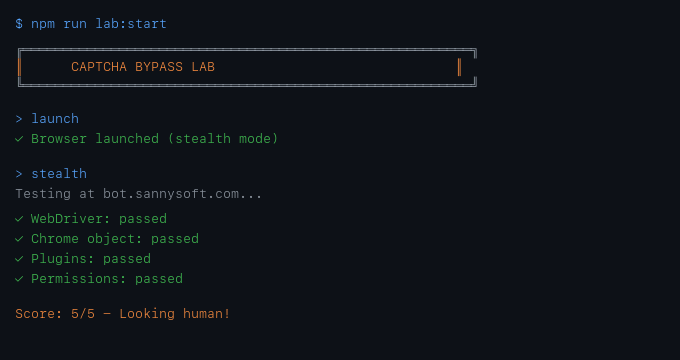

# CAPTCHA Automation Workshop

**Baltimore AI Producers Lab** - Learn by building, not just consuming.



---

## First Time? Open Your Terminal

<details>
<summary><strong>🍎 Mac Users</strong> (click to expand)</summary>

### Option 1: Spotlight (Fastest)
1. Press `Cmd + Space`
2. Type `Terminal`
3. Press `Enter`

### Option 2: Finder
1. Open **Finder**
2. Go to **Applications** → **Utilities**
3. Double-click **Terminal**

### Option 3: Launchpad
1. Click the **Launchpad** icon in your dock (grid of squares)
2. Type `Terminal` in the search bar
3. Click the Terminal icon

</details>

<details>
<summary><strong>🪟 Windows Users</strong> (click to expand)</summary>

### Option 1: Search (Fastest)
1. Press `Windows key`
2. Type `cmd` or `PowerShell`
3. Press `Enter`

### Option 2: Run Dialog
1. Press `Windows + R`
2. Type `cmd`
3. Press `Enter`

### Option 3: Right-click Start Menu
1. Right-click the **Start** button
2. Select **Windows Terminal** or **Command Prompt**

> **Tip**: PowerShell works too! Commands are the same.

</details>

<details>
<summary><strong>🐧 Linux Users</strong> (click to expand)</summary>

1. Press `Ctrl + Alt + T` (most distros)
2. Or find **Terminal** in your applications menu

</details>

---

## Get the Code

```bash
git clone https://github.com/w4ester/captcha-workshop.git
cd captcha-workshop
```

> **Don't have git?** Download the [ZIP file](https://github.com/w4ester/captcha-workshop/archive/refs/heads/main.zip) and unzip it.

> **Don't have Node.js?** Download it from [nodejs.org](https://nodejs.org/) (LTS version recommended)

---

## 3-Step Setup

```bash
# 1. Enter the lab
cd captcha-bypass-lab

# 2. Install everything (takes 2-3 minutes first time)
npm run setup

# 3. Start exploring!
npm run lab:start
```

That's it. You're in!

---

## What You'll Build

A multi-agent browser automation system that:
- Detects CAPTCHAs automatically ("Land Ho!" alerts)
- Records what you're doing
- Uses stealth techniques to look human
- Integrates with Claude Code via MCP

---

## Quick Commands

| Command | What it does |
|---------|--------------|
| `npm run lab:start` | Interactive mode - type commands |
| `npm run lab:demo` | Watch a full demo run |
| `npm run lab:stealth-test` | Test if you look like a bot |

### Once in Interactive Mode

```
> launch              # Start the browser
> navigate google.com # Go somewhere
> screenshot          # Capture what you see
> record start        # Start recording
> stealth             # Run bot detection test
> quit                # Exit
```

---

## The Big Idea

> "Machines bypassing machines that train machines"

Every CAPTCHA you solve trains AI models for free. This workshop teaches you to understand detection systems, not just consume tools.

**Producer Mindset**: Build systems, don't just use them.

---

## Workshop Structure

```
captcha-workshop/
├── README.md               # You are here
├── SETUP-CLAUDE-CODE.md    # 🆕 First time? Start here!
├── CLAUDE-CODE-PROMPT.md   # 🤖 Paste this into Claude Code!
├── WORKSHOP-EMAIL.md       # 📧 Email templates for organizers
├── QUICK-START.md          # Fast reference
├── 00-producer-mindset.md  # The philosophy
├── assets/                 # Demo images & GIFs
└── captcha-bypass-lab/     # The actual code
    ├── lessons/            # Step-by-step guides
    ├── agents/             # Multi-agent system
    ├── browser/            # Stealth browser setup
    ├── detectors/          # CAPTCHA detection
    └── mcp/                # Claude Code integration
```

---

## For Claude Code Users

**New to Claude Code?** Start here: [`SETUP-CLAUDE-CODE.md`](SETUP-CLAUDE-CODE.md) - Get your free 7-day trial and install in 10 minutes!

**Already have Claude Code?** Copy the prompt from [`CLAUDE-CODE-PROMPT.md`](CLAUDE-CODE-PROMPT.md) and paste it in!

Claude will:
1. Clone and set up the workshop
2. Run the demo and explain what's happening
3. Test sites you give it from your professional life
4. Teach you the producer mindset along the way

### MCP Server Integration (Advanced)

Add to your `.claude/claude_desktop_config.json` or `.claude.json`:

```json
{
  "mcpServers": {
    "captcha-lab": {
      "command": "node",
      "args": ["mcp/server-standalone.js"],
      "cwd": "/FULL/PATH/TO/captcha-bypass-lab"
    }
  }
}
```

Then Claude can control the browser directly with commands like:
- `browser_launch`
- `browser_navigate`
- `captcha_status`
- `browser_screenshot`

---

## Requirements

- **Node.js 18+** (check: `node --version`)
- **npm** (comes with Node)
- **A few minutes** to download the browser

---

## Having Issues?

**"Browser not found"** - Run `npm run setup:browser` inside captcha-bypass-lab

**"Permission denied"** - Run `chmod +x browser/*.sh`

**"Port in use"** - Another instance is running, kill it or use a different port

---

## Learn More

- `captcha-bypass-lab/lessons/00-producer-mindset.md` - Why this matters
- `captcha-bypass-lab/lessons/01-setup-browser.md` - Deep dive on the tech
- `captcha-bypass-lab/README.md` - Full architecture docs

---

## Let's GrOw!

Built with the Baltimore AI Producers Lab - where we learn by building.

**Questions?** Open an issue or reach out to the workshop facilitator.
